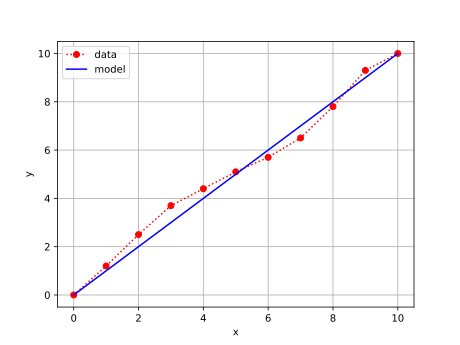

# comparison
<br>
Fig 1. Arithmetic growth: model ($\color{blue}{-}$) dan data ($\color{red}{\cdot}$).


```shell
$ python data_vs_model.py
x       ydata   ymodel
0       0       0.0
1       1.2     1.0
2       2.5     2.0
3       3.7     3.0
4       4.4     4.0
5       5.1     5.0
6       5.7     6.0
7       6.5     7.0
8       7.8     8.0
9       9.3     9.0
10      10      10.0
```
