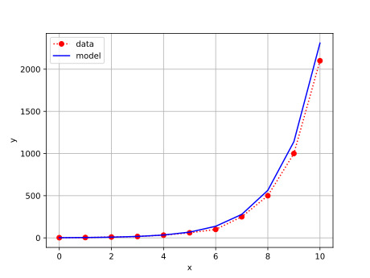

# comparison
<br>
Fig 1. Arithmetic growth: model ($\color{blue}{-}$) dan data ($\color{red}{\cdot}$).


```shell
$ python data_vs_model.py
x       ydata   ymodel
0       2       2.0
1       4       4.048333333333334
2       10      8.194501388888892
3       16      16.587036561342597
4       32      33.57492650625098
5       60      67.96124706973636
6       100     137.56489094365804
7       250     278.4542667517878
8       500     563.6378449500774
9       1000    1140.8969378197817
10      2100    2309.365551636875
```
