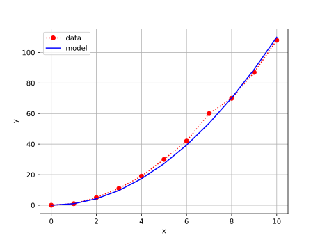

# comparison
<br>
Fig 1. Arithmetic growth: model ($\color{blue}{-}$) dan data ($\color{red}{\cdot}$).


```shell
$ python data_vs_model.py
x       ydata   ymodel
0       0       0.0
1       1       1.0
2       5       4.222222222222222
3       11      9.666666666666668
4       19      17.333333333333336
5       30      27.22222222222222
6       42      39.333333333333336
7       60      53.66666666666667
8       70      70.22222222222223
9       87      89.0
10      108     110.0
```
