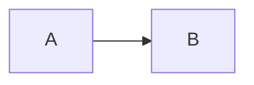

beg="""
# an example
$$\tag{1}
y = ax^2 + bx + c
$$
```python """

import math

l_ = math.log(2)
t_ = math.log(2) / l_
print(l_, t_)


dt = 0.5 / l_ / 1

N1 = 100

for i in range(0, 20):
  print(i, N1)
  N1 = N1 * (1  - l_ * dt)


end="""
```



"""