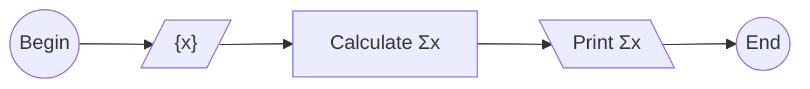

$$\tag{1}
\sum_{i = 1}^n x_i = x_1 + x_2 + \dots + x_n
$$

$$\tag{2}
\sum_{i = 1}^n i = n
$$





```python
def sum_of(z):
  s = 0
  for i in z:
    s += i
  return s

x = [1, 6, 2, 7, 3, 8, 4, 9, 5, 10]
sox1 = sum_of(x)
sox2 = sum(x)

print("x:", x)
print()

print("Using user defined function")
print("sum of x:", sox1)
print()

print("Using built-in function sum()")
print("sum of x:", sox2)
```


```shell
$ ./mdpy.sh src/ease/math/repetition/sum.md
x: [1, 6, 2, 7, 3, 8, 4, 9, 5, 10]

Using user defined function
sum of x: 55

Using built-in function sum()
sum of x: 55
```