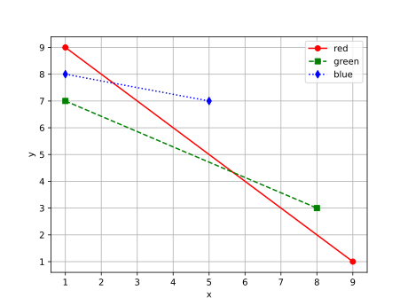

# axis_label
```python
import matplotlib.pyplot as plt

x1 = [1, 9]
y1 = [9, 1]

x2 = [1, 8]
y2 = [7, 3]

x3 = [1, 5]
y3 = [8, 7]

legends = ['red', 'green', 'blue']

plt.plot(x1, y1, 'ro-', x2, y2, 'gs--', x3, y3, 'bd:')
plt.legend(legends)
plt.grid()
plt.xlabel("x")
plt.ylabel("y")
plt.show()
```


```shell
$ python axis_label.py
```



