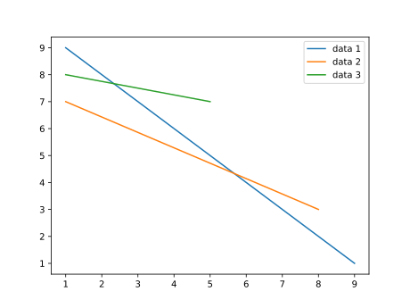

# legend
```python
import matplotlib.pyplot as plt

x1 = [1, 9]
y1 = [9, 1]

x2 = [1, 8]
y2 = [7, 3]

x3 = [1, 5]
y3 = [8, 7]

legends = ['data 1', 'data 2', 'data 3']

plt.plot(x1, y1, x2, y2, x3, y3)
plt.legend(legends)
plt.show()
```


```shell
$ python legend.py
```



