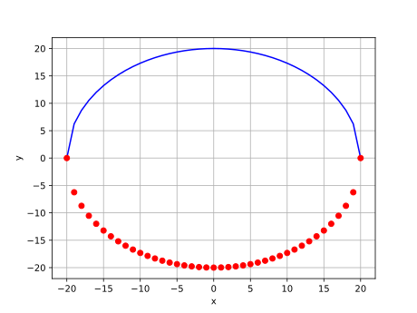

# line_marker_only
```python
import matplotlib.pyplot as plt

r = 20
x = [*range(-r, r+1)]
y = [(r*r - i*i)**0.5 for i in x]
z = [-i for i in y]

plt.plot(x, y, 'b-', x, z, 'ro')
plt.grid()
plt.xlabel("x")
plt.ylabel("y")
plt.show()
```


```shell
$ python line_marker_only.py
```



