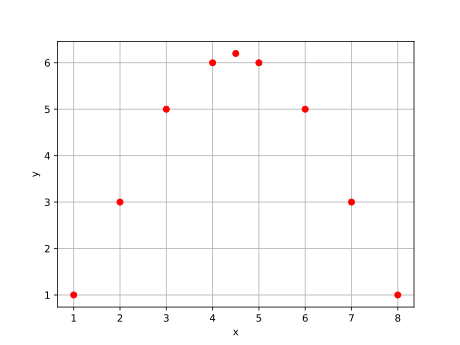

# marker_only
```python
import matplotlib.pyplot as plt

x = [1, 2, 3, 4, 4.5, 5, 6, 7, 8]
y = [1, 3, 5, 6, 6.2, 6, 5, 3, 1]


plt.plot(x, y, 'ro')
plt.grid()
plt.xlabel("x")
plt.ylabel("y")
plt.show()
```


```shell
$ python marker_only.py
```


