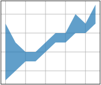

# subplots_fill_between
```python
import matplotlib.pyplot as plt

plt.style.use("_mpl-gallery")

x = [i for i in range(10)]
y1 = [1, 2, 3, 3, 4, 5, 5, 6, 6, 7]
y2 = [7, 5, 4, 4, 5, 6, 6, 8, 7, 9]

fig, ax = plt. subplots()

ax.fill_between(x, y1, y2, alpha=0.7, linewidth=4)

plt.show()
```


```shell
$ python subplots_fill_between.py
```


