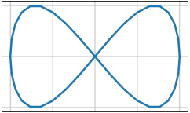

# subplots_plot
```python
import matplotlib.pyplot as plt
import math as m

plt.style.use("_mpl-gallery")

x = [m.cos(m.radians(i*10)) for i in range(37)]
y = [m.sin(2 * m.radians(i*10)) for i in range(37)]

fig, ax = plt. subplots()

ax.plot(x, y, linewidth=2.5)

plt.show()
```


```shell
$ python subplots_plot.py
```


