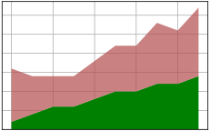

# subplots_stackplot
```python
import matplotlib.pyplot as plt

plt.style.use("_mpl-gallery")

x = [i for i in range(10)]
y1 = [1, 2, 3, 3, 4, 5, 5, 6, 6, 7]
y2 = [7, 5, 4, 4, 5, 6, 6, 8, 7, 9]

fig, ax = plt. subplots()

alpha = 0.7
ax.stackplot(x, y1, y2, colors=['g', (0.7, 0.3, 0.3, alpha)])

plt.show()
```


```shell
$ python subplots_stackplot.py
```



