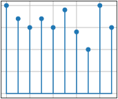

# subplots_stem
```python
import matplotlib.pyplot as plt
import random as r

plt.style.use("_mpl-gallery")

x = [i for i in range(10)]
y = [r.randint(10, 20) for i in x]

fig, ax = plt. subplots()

ax.stem(x, y)

plt.show()
```


```shell
$ python subplots_stem.py
```



