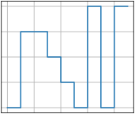

# subplots_step
```python
import matplotlib.pyplot as plt
import random as r

plt.style.use("_mpl-gallery")

x = [i for i in range(10)]
y = [1, 1, 4, 4, 3, 2, 1, 5, 1, 5]

fig, ax = plt. subplots()

ax.step(x, y)

plt.show()
```


```shell
$ python subplots_step.py
```



