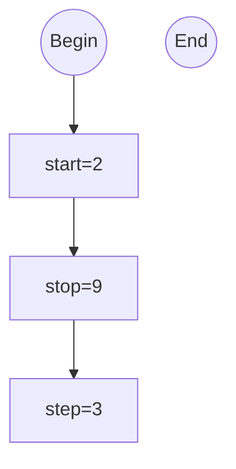

<pre><code>```mermaid
```</code></pre>



```mermaid
flowchart TB
  B --> I1 --> I2 --> I3
  I1["start=2"]
  I2["stop=9"]
  I3["step=3"]
  B(("Begin"))
  E(("End"))
```


```python
x = range(2, 9, 3)

for i in x:
  print(i)

```


```shell
$ python range.py
2
5
8
```