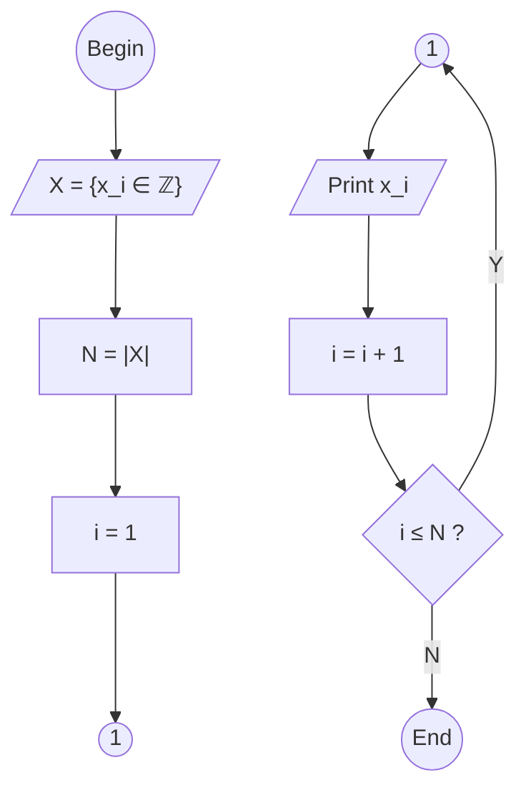

<pre><code>```mermaid
flowchart TB
  B --> I --> P1 --> P2 --> o1a
  o1b --> O --> P3 --> C --"Y"--> o1b
  C --"N"--> E
  B(("Begin"))
  I[/"X = {x_i &in; &integers;} "/]
  P1["N = |X|"]
  P2["i = 1"]
  o1a(("1"))
  o1b(("1"))
  O[/"Print x_i"/]
  C{"i &le; N ?"}
  P3["i = i + 1"]
  E(("End"))
```</code></pre>




```python
x = [8, 4, 2, 1, 3, 5, 7]

for i in x:
  print(i)
```

```shell
$ python for_list.py
8
4
2
1
3
5
7
```
