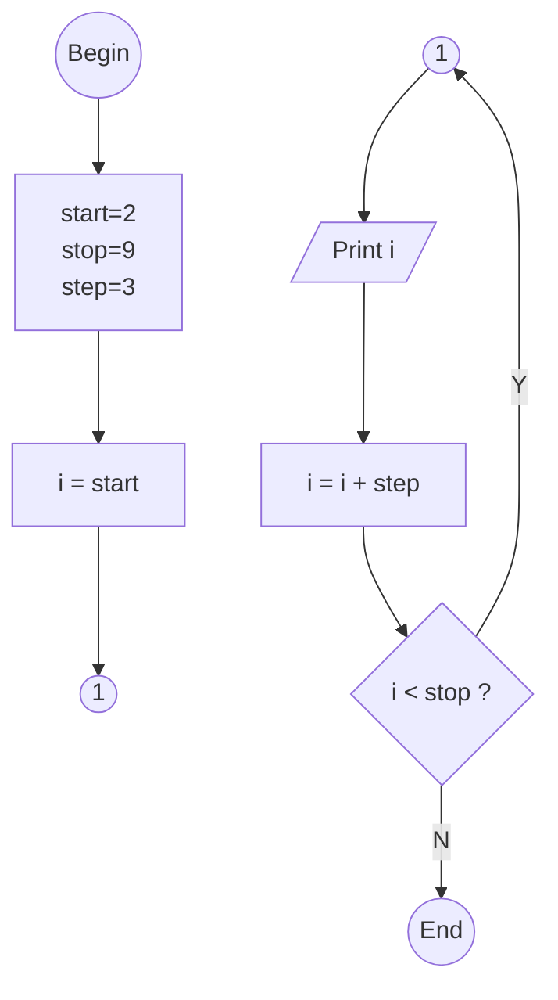

<pre><code>```mermaid
flowchart TB
  B --> I --> P1 --> C1a
  C1b --> O --> P2 --> C --"Y"--> C1b
  C --"N"--> E
  B(("Begin"))
  I["start=2&lt;br&gt;stop=9&lt;br&gt;step=3"]
  P1["i = start"]
  C1a(("1"))
  C1b(("1"))
  O[/"Print i"/]
  P2["i = i + step"]
  C{"i < stop ?"}
  E(("End"))
```</code></pre>





```python
start = 2
stop = 9
step 3

x = range(start, stop, step)

for i in x:
  print(i)

```


```shell
$ python range.py
2
5
8
```
