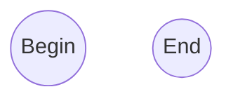

<pre><code>```mermaid
  flowchart TB
```</code></pre>




```python
def f(x):
  y = (x - 2.3)
  return y

xbeg = 0
xend = 10
dx = 0.5

yold = f(xbeg)
x = xbeg
print("x    y")
while x <= xend:
  y = f(x)
  
  xs = f'{x:.1f}'
  ys = f'{y:+.1f}'
  print(xs, ys)
  
  if y * yold < 0:
    break
  
  yold = y
  
  x += dx
```

```shell
$ python while.py
x    y
0.0 -2.3
0.5 -1.8
1.0 -1.3
1.5 -0.8
2.0 -0.3
2.5 +0.2
```
