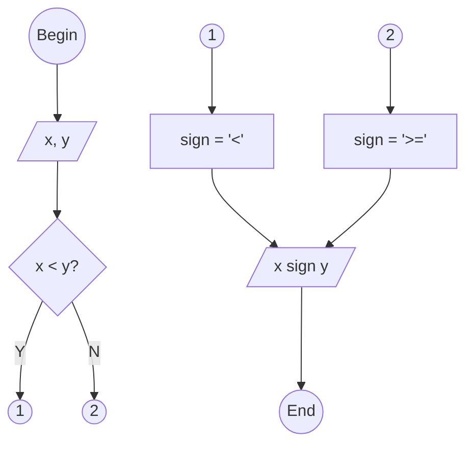

<pre>

</pre>


```python
# begin

# input
x = float(input("x = "))
y = float(input("y = "))

# decision
if x < y:
  # process 1
  sign= "<"
else:
  # process 2
  sign = ">="

# ouput
print(x, sign, y)

# end


"""
$ python compare.py
x = 3
y = 6
3.0 < 6.0
$ python compare.py
x = 6
y = 2
6.0 >= 2.0
"""
```
