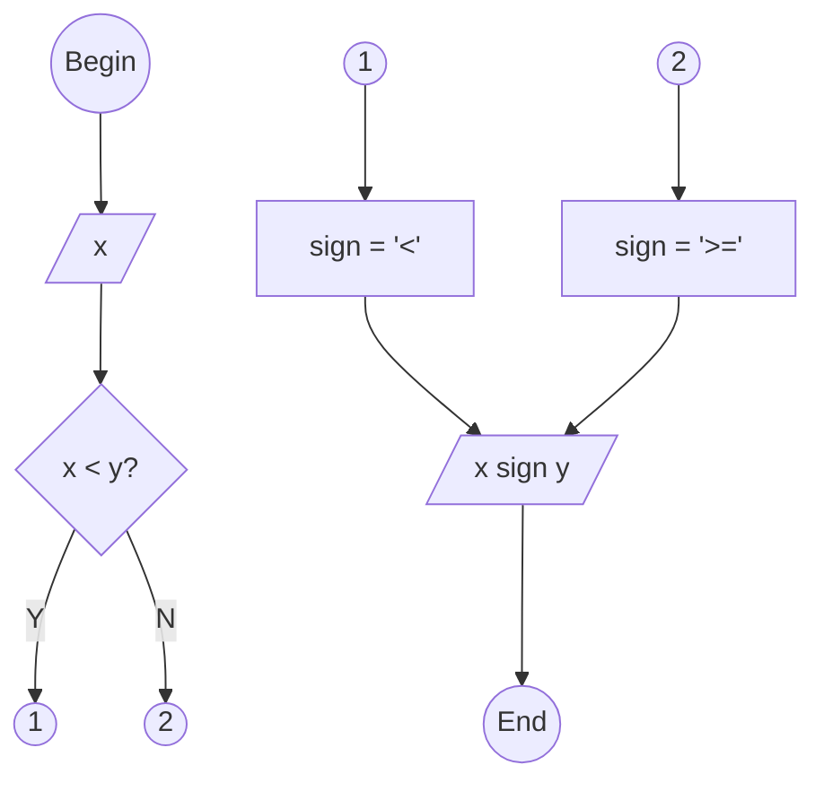

<pre>

```mermaid
flowchart TD
  B --> I --> D
  D --Y--> C1a
  D --N--> C2a
  C1b --> P1 --> O
  C2b --> P2 --> O
  O --> E
  C1a(("1"))
  C1b(("1"))
  C2a(("2"))
  C2b(("2"))
  B(("Begin"))
  I[/"x"/]
  D{"x < y?"}
  P1["sign = '<'"]
  P2["sign = '>='"]
  O[/"x sign y"/]
  E(("End"))
```
</pre>

```mermaid
flowchart TD
  B --> I --> D
  D --Y--> C1a
  D --N--> C2a
  C1b --> P1 --> O
  C2b --> P2 --> O
  O --> E
  C1a(("1"))
  C1b(("1"))
  C2a(("2"))
  C2b(("2"))
  B(("Begin"))
  I[/"x"/]
  D{"x < y?"}
  P1["sign = '<'"]
  P2["sign = '>='"]
  O[/"x sign y"/]
  E(("End"))
```

+ [code](compare.py)
