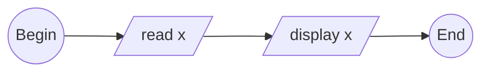

<pre>

```mermaid
flowchart LR
  B --> I --> O --> E
  B(("Begin"))
  I[/"read x"/]
  O[/"display x"/]
  E(("End"))
```
</pre>

```mermaid
flowchart LR
  B --> I --> O --> E
  B(("Begin"))
  I[/"read x"/]
  O[/"display x"/]
  E(("End"))
```

+ [code](inout.py)