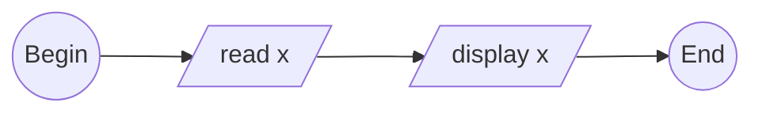

<pre>

</pre>


```python
# begin

# input
x = float(input("Input a number: "))

# ouput
print("The number is:", x)

# end


"""
$ python inout.py
Input a number: 934E-3
The number is: 0.934
"""
```
