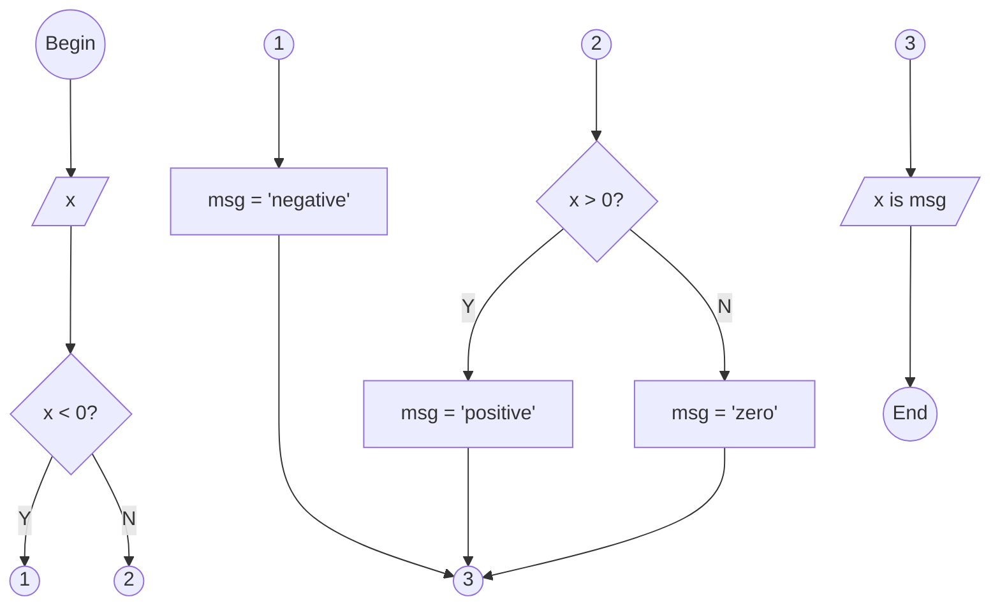
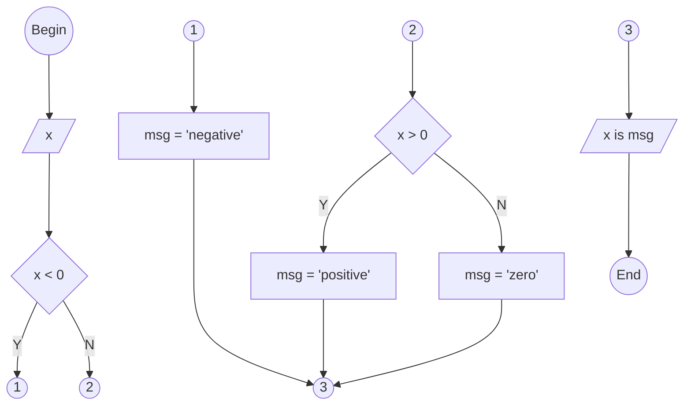

<pre>

</pre>





```python
# begin

# input
x = float(input("Give a number : "))

# decision
if x < 0:
  # process 1
  msg = "negative"
elif x > 0:
  # process 2
  msg = "positive"
else:
  # process 3
  msg = "zero"

# ouput
print(x, "is", msg)

# end


"""
$ python negzeropos.py
Give a number : 5.3
5.3 is positive
$ python negzeropos.py
Give a number : -9.41
-9.41 is negative
$ python negzeropos.py
Give a number : 0
0.0 is zero
"""
```
