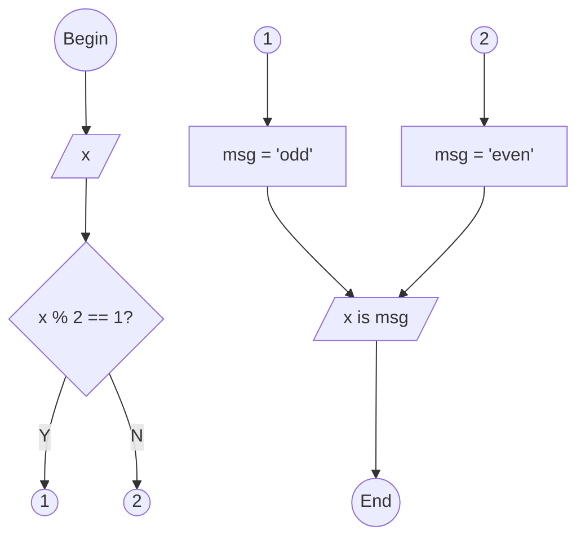

<pre>

</pre>


```python
# begin

# input
x = int(input("Give a number : "))

# decision
if x % 2 == 1:
  # process 1
  msg = "odd"
else:
  # process 2
  msg = "even"

# ouput
print(x, "is", msg)

# end


"""
$ python oddeven.py
Give a number : 2
2 is even
$ python oddeven.py
Give a number : 3
3 is odd
"""
```
