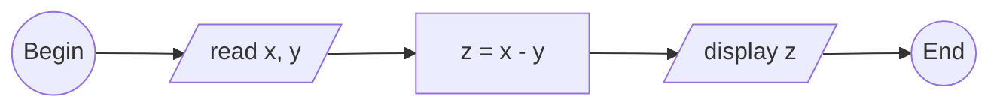

<pre>

```mermaid
flowchart LR
  B --> I --> P --> O --> E
  B(("Begin"))
  I[/"read x, y"/]
  P["z = x - y"]
  O[/"display z"/]
  E(("End"))
```
</pre>

```mermaid
flowchart LR
  B --> I --> P --> O --> E
  B(("Begin"))
  I[/"read x, y"/]
  P["z = x - y"]
  O[/"display z"/]
  E(("End"))
```

+ [code](substract.py)