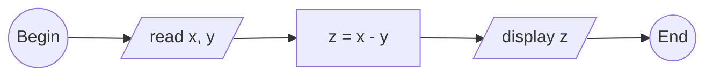

<pre>

</pre>


```python
# begin

# input
x = float(input("x = "))
y = float(input("y = "))

# process
z = x - y

# ouput
print("z = x - y =", z)

# end


"""
$ python substract.py
x = 5
y = 7.2
z = x - y = -2.2
"""
```