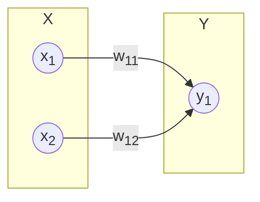

# layers_21

$$\tag{1}
\mathbf{Y}_{(1×1)} = f(\mathbf{W}_{(1×2)} \mathbf{X}_{(2×1)})
$$

$$\tag{2}
\left[
\begin{array}{c}
y_1
\end{array}
\right] = \left[
\begin{array}{cc}
w_{11} & w_{12}
\end{array}
\right] \left[
\begin{array}{c}
x_1 \newline
x_2
\end{array}
\right]
$$

$$\tag{3}
f(z) = \frac{1}{1 + e^{-z}}
$$
