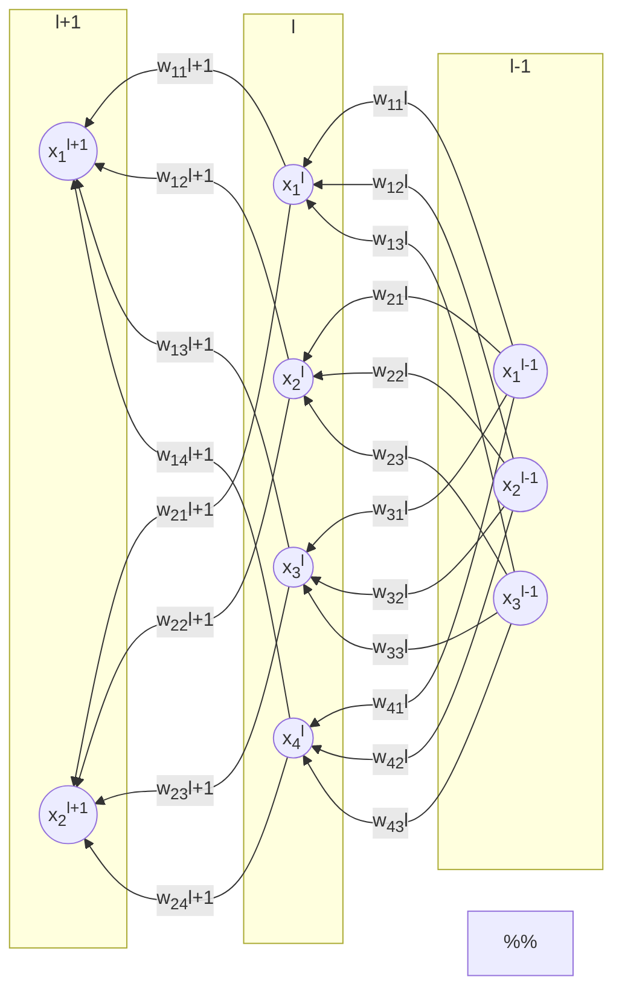

# concept

```mermaid
flowchart RL
  subgraph "l-1"
    x1lm1(("x<sub>1</sub><sup>l-1</sup>"))
    x2lm1((""x<sub>2</sub><sup>l-1</sup>""))
    x3lm1((""x<sub>3</sub><sup>l-1</sup>""))
  end
  subgraph "l"
    x1l(("x<sub>1</sub><sup>l</sup>"))
    x2l(("x<sub>2</sub><sup>l</sup>"))
    x3l(("x<sub>3</sub><sup>l</sup>"))
    x4l(("x<sub>4</sub><sup>l</sup>"))
  end
  subgraph "l+1"
    x1lp1(("x<sub>1</sub><sup>l+1</sup>"))
    x2lp1(("x<sub>2</sub><sup>l+1</sup>"))
  end
  %%
  x1l --"w<sub>11</sub>l+1</sup>"--> x1lp1
  x1l --"w<sub>21</sub>l+1</sup>"--> x2lp1
  %%
  x2l --"w<sub>12</sub>l+1</sup>"--> x1lp1
  x2l --"w<sub>22</sub>l+1</sup>"--> x2lp1
  %%
  x3l --"w<sub>13</sub>l+1</sup>"--> x1lp1
  x3l --"w<sub>23</sub>l+1</sup>"--> x2lp1
  %%
  x4l --"w<sub>14</sub>l+1</sup>"--> x1lp1
  x4l --"w<sub>24</sub>l+1</sup>"--> x2lp1
  %%
  x1lm1 --"w<sub>11</sub>l</sup>"--> x1l
  x1lm1 --"w<sub>21</sub>l</sup>"--> x2l
  x1lm1 --"w<sub>31</sub>l</sup>"--> x3l
  x1lm1 --"w<sub>41</sub>l</sup>"--> x4l
  %%
  x2lm1 --"w<sub>12</sub>l</sup>"--> x1l
  x2lm1 --"w<sub>22</sub>l</sup>"--> x2l
  x2lm1 --"w<sub>32</sub>l</sup>"--> x3l
  x2lm1 --"w<sub>42</sub>l</sup>"--> x4l
  %%
  x3lm1 --"w<sub>13</sub>l</sup>"--> x1l
  x3lm1 --"w<sub>23</sub>l</sup>"--> x2l
  x3lm1 --"w<sub>33</sub>l</sup>"--> x3l
  x3lm1 --"w<sub>43</sub>l</sup>"--> x4l
```
