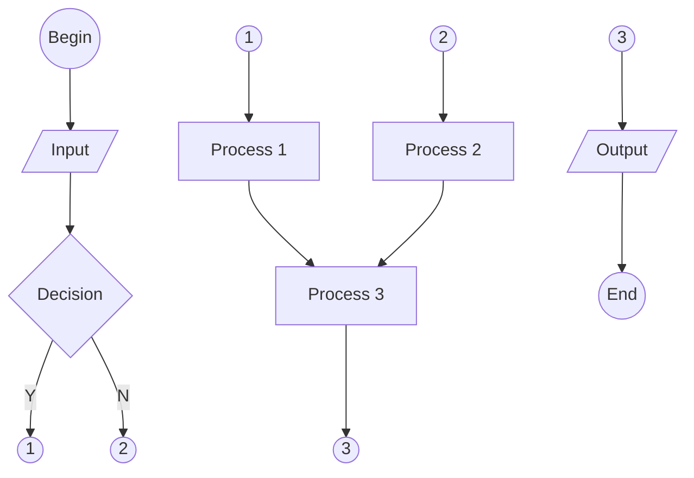

<pre>

```mermaid
flowchart TB
  B --> I --> D
  D --Y--> O1a
  D --N--> O2a
  O1b --> P1 --> P3 --> O3a
  O2b --> P2 --> P3
  O3b --> O --> E
  B(("Begin"))
  I[/"Input"/]
  D{"Decision"}
  O1a(("1"))
  O2a(("2"))
  O3a(("3"))
  O1b(("1"))
  O2b(("2"))
  O3b(("3"))
  P1["Process 1"]
  P2["Process 2"]
  P3["Process 3"]
  O[/"Output"/]
  E(("End"))
```
</pre>

```mermaid
flowchart TB
  B --> I --> D
  D --Y--> O1a
  D --N--> O2a
  O1b --> P1 --> P3 --> O3a
  O2b --> P2 --> P3
  O3b --> O --> E
  B(("Begin"))
  I[/"Input"/]
  D{"Decision"}
  O1a(("1"))
  O2a(("2"))
  O3a(("3"))
  O1b(("1"))
  O2b(("2"))
  O3b(("3"))
  P1["Process 1"]
  P2["Process 2"]
  P3["Process 3"]
  O[/"Output"/]
  E(("End"))
```
