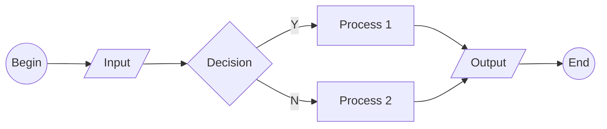

<pre>

```mermaid
flowchart LR
  B --> I --> D
  D --Y--> P1
  D --N--> P2
  P1 & P2 -->  O --> E
  B(("Begin"))
  I[/"Input"/]
  D{"Decision"}
  P1["Process 1"]
  P2["Process 2"]
  O[/"Output"/]
  E(("End"))
```
</pre>

```mermaid
flowchart LR
  B --> I --> D
  D --Y--> P1
  D --N--> P2
  P1 & P2 -->  O --> E
  B(("Begin"))
  I[/"Input"/]
  D{"Decision"}
  P1["Process 1"]
  P2["Process 2"]
  O[/"Output"/]
  E(("End"))
```
