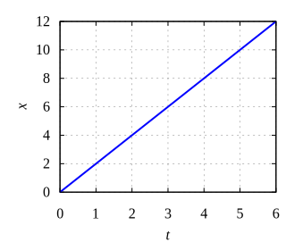
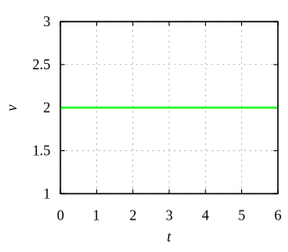
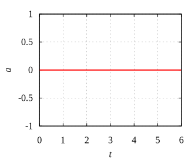

# graph_xvat

$$\tag{1}
x(t) = x_0 + v_0 \cdot (t - t_0)
$$



$$\tag{2}
v(t) = v_0
$$



$$\tag{3}
a(t) = 0
$$




```shell
$ ../../../../../mdgnu.sh graph_xvat.md
```


```gnuplot
set term svg size 320,280 font "Times, 16" enhanced
set grid
set tics scale 0.4
set xlabel "{/Times:Italic t}" offset 0, 0.5
set xrange [0:6]
set ylabel '' offset 2
set lmargin 6
set rmargin 1

rcolor = '#0000ff'
vcolor = '#00ff00'
acolor = '#ff0000'

x_0 = 2
t_0 = 1
v_0 = 2
r(t) = x_0 + v_0 * (t - t_0)
v(t) = v_0
a(t) = 0

num = ''

set output 'xt'.num.'.svg'
set ylabel "{/Times:Italic x}"
plot r(x) t '' w l lw 2 lc rgb rcolor

set output 'vt'.num.'.svg'
set ylabel "{/Times:Italic v}"
set yrange [1:3]
plot v(x) t '' w l lw 2 lc rgb vcolor

set output 'at'.num.'.svg'
set ylabel "{/Times:Italic a}"
set yrange [-1:1]
plot a(x) t '' w l lw 2 lc rgb acolor
```
