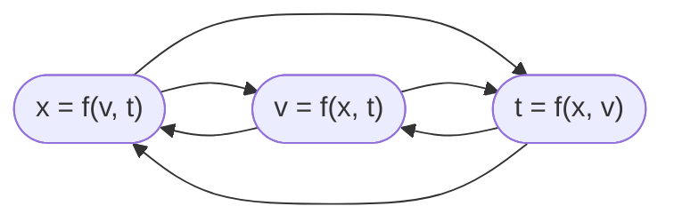

# vars
$$\tag{1}
x = x_0 + v \cdot (t - t_0)
$$

Symbol | Unit | Note
:-: | :-: | :-
$t$ | $\rm s$ | time
$t_0$ | $\rm s$ | initial time
$x$ | $\rm m$ | position
$x_0$ | $\rm m$ | initial position
$v$ | $\rm m/s$ | velocity

